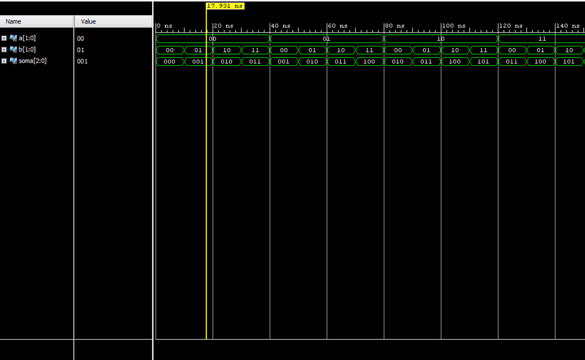
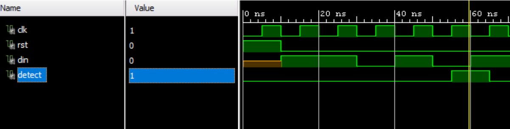
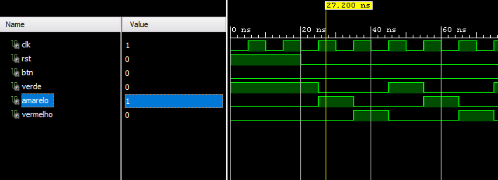

1)Somador de 2 bits

O TestBench realiza uma verificação exaustiva. Ele simula todas as 16 combinações de entrada possíveis, iterando os valores de a de "00" a "11" e os valores de b de "00" a "11". Isso garante que cada resultado da soma seja validado em relação ao valor esperado, cobrindo todo o escopo de funcionamento do circuito.

2) Detector de sequencia

O TestBench foi projetado para validar a FSM em múltiplos cenários. Ele envia um fluxo de bits contínuo que inclui:
Sequências que não ativam a saída detect.
A sequência correta "11010" para confirmar que detect vai para '1'.
Sequências com padrões parciais e incorretos para garantir que a máquina de estados retorne ao estado inicial corretamente sem falsos positivos.

3) Semaforo

O TestBench valida os dois principais modos de operação do semáforo:
Ciclo Normal: Inicialmente, o btn de pedestre é mantido em '0', e o TestBench verifica se o semáforo transita corretamente entre os estados Verde, Amarelo e Vermelho com seus tempos padrões.
Ciclo com Pedestre: Em um segundo momento, o sinal btn é ativado ('1') durante o estado Verde. O TestBench então verifica se a FSM completa o estado Verde, passa pelo Amarelo e entra em um estado Vermelho com duração estendida, antes de retornar ao ciclo normal.
